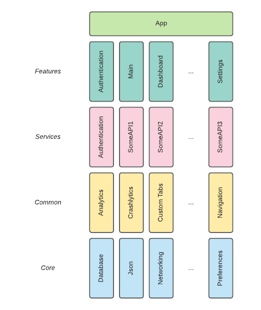

# Modules structure

Android Template follows simple modules structure that should fit small, medium and large-sized projects.
All modules should expose only minimal API, all classes irrelevant to the other modules should be marked as `internal`.
Prefer exposing only interfaces, implementations should be provided using DI mechanism.

[Application module](../app) should be minimal and contain only code that is needed to bind feature modules into the application.

Feature modules should be placed in the [features](../features) group. Feature modules can wrap one or more application screens/processes that logically form a feature.
They can have their own navigation, should only expose a way to enter the feature and pass initial arguments, and optionally can return process result.
They should not depend on each other - instead, global navigation mechanism should be used to navigate between features.

Service modules should be placed in the [services](../services) group. Service modules wrap business logic, networking, database operations,
combine them and expose simple API that can be easily used by feature modules. One service module should wrap one logical unit of business logic.
They should not depend on each other.

Common modules should be placed in the [common](../common) group. Common modules wrap commonly used generic features that are not core features,
features that can be considered as an addition to the codebase, and can be safely removed without impacting the core functionalities of the app.
Dependencies between common modules are allowed, but they should be introduced only if there's an important need to have them.
Examples of common modules: analytics, crash reporting, Custom Tabs, common UI, navigation.

Core modules should be places in the [core](../core) group. Core modules provide important functionalities that are commonly used across feature and service modules.
Core modules are considered as base ones and rarely should be a subject to removal. Dependencies between core modules are allowed,
but they should be introduced only if there's an important need to have them. Examples of core modules: networking, database, JSON parsing.

Common modules can depend on core modules. Core modules cannot depend on common modules.

To not introduce a confusion with common modules, and to not increase number of top-level module groups unnecessarily, introducing "libs" modules group is not recommended.
Instead, modules that can be considered as "libs" modules, should be places in the [common](../common) group.
