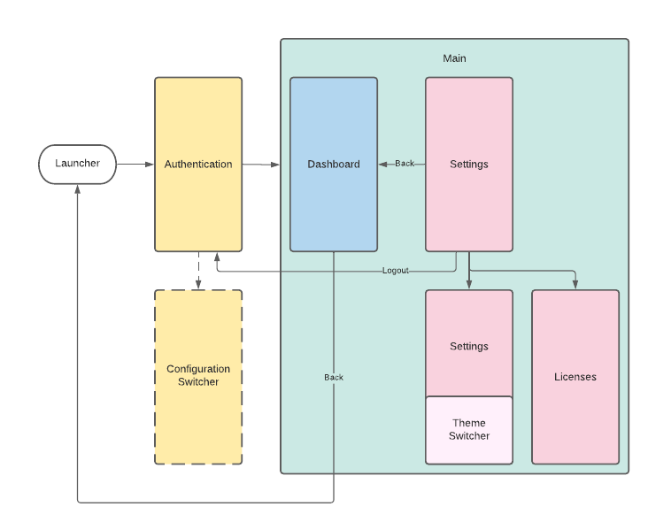

# Screens and flow

Android Template not only provides generic modules that can be used across your project's implementation.
It also contains sample screens implementation that together form a flow that can be used in a typical application.

When the user opens the app for the first time, navigation to the Onboarding screen shows up. The onboarding screen includes three
identical screens, which are based on HorizontalPager. The last screen has two additional buttons - each of them has a different
function. The first one navigates to the Authentication screen and sends a firebase event, which informs about the displayed onboarding
screen. The second one is based on custom tabs and steers to the "privacy policy" link. When the user opens the application again, it
will navigate to the Authentication screen. That's where login/registration flow should be implemented.
In debug or qa build, you can also invoke configuration switcher screen there. It is not available in release builds.

After successfully authenticating, user is navigated to the Main screen. Main screen displays bottom navigation that allows to switch 
between Dashboard and Settings screens. From Settings screen, one can switch application theme, navigate to Licenses screen, or tap 
Logout button, which takes user back to the Authentication screen. Note that navigating back on the Settings screen takes user back 
to the Dashboard, and navigating back on the Dashboard exits the application.
